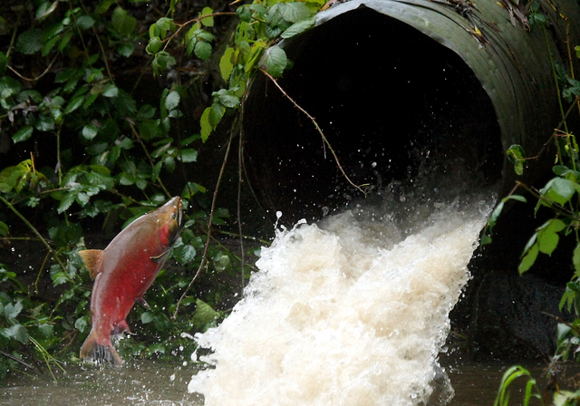

## The Culvert Case 

Culverts are water crossing structures for waterways that are too small to justify a bridge. 
Culverts can support support traffic overhead and salmon migration pathways below.  Due to climate change, river behaviors are 
changing and the bankflow width is likely to vary at a higher rate than previously. Culverts are designed for 30-50 year lifetime 
and must be able to allow salmon migration during this period due to the court case United States v. Washington.

In the Culvert Case, Washington State government was ordered by a federal court to replace all state - owned culverts located on 
the Olympic Peninsula, in the Puget Sound Basin, or in the Chehalis River Basin that block 200 meters or more of salmon habitat. 
About 10,000 culverts are estimated to fit that description, and their replacement with culverts that pass fish is estimated to 
cost about $2.45 billion.

Washington State is responsible for identifying the culverts that will not be viable for salmon migration and replace them. Given that 
the replacement process is already very costly and time consuming, the greatest financial loss would occur if the culvert replacement 
did not account for stream width change and warranted multiple replacements. 

## Dataset 

I collaborated with the University of Washington Climate Impacts group (CIG) to study meteorological data through rigorous climate change models and develop a tool to represent the probability of stream width change over the design lifetime of a culvert. There are 10 models selected by CIG and each one provides daily projected stream flow for certain latitude and longitude for the next 100 years. Multi-model ensembles are considered the best way to estimate uncertainty for climate projections. These models were developed by several academic institutions and the results vary.

These models generated 949 Gb of raw data each in NetCDF format. 

##Data Preparation 

As a final product, I developed a website where a civil engineer can enter in coordinates and receive the likelihood of stream width change. This information will help Washington state better understand their construction costs and prevent replacement costs in the future. Furthermore, this tool will will help ensure salmon migration is preserved and building plans are conscious of weather changes in the coming years. 

